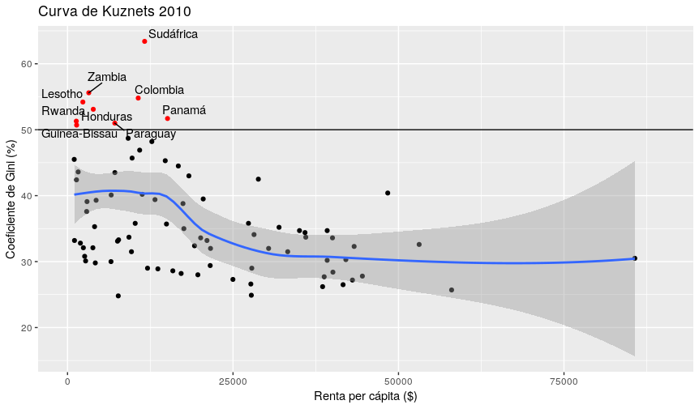
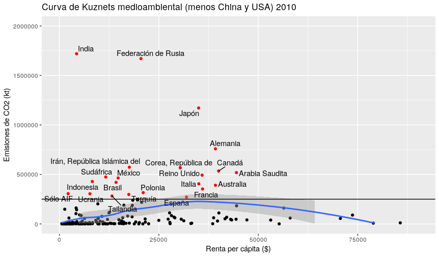
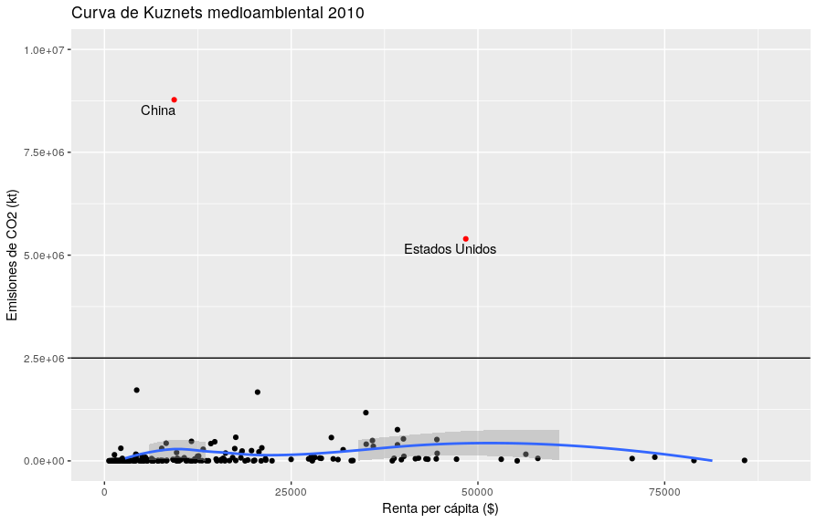

# Curva de Kuznets
Autor: Michael A. Johnson Lucas

```r
setwd(dirname(rstudioapi::getSourceEditorContext()$path))

library(ggplot2)
library(readr)
library(magrittr)
library(dplyr)
library(stringr)
library(ggrepel)

gini <- read_csv("./kuznets_2010.csv")
co2 <- read_csv("./kuznets_co2_2010.csv")
# gini <- gini %>% filter(!str_detect(`Country Code`, 'FRA|KGZ|EST'))

kuznet <- data.frame(gini$`Country Name`, gini$Gini, gini$`Income per capita`, stringsAsFactors = TRUE)
colnames(kuznet) <- c("country", "gini", "income_per_capita")

kuznet_co2 <- data.frame(co2$`Country Name`, co2$co2, co2$`Income per capita`, stringsAsFactors = TRUE)
colnames(kuznet_co2) <- c("country", "co2", "income_per_capita")

diagram <- ggplot(data = kuznet, aes(x = income_per_capita, y = gini, label = country))+ geom_point(color = ifelse(kuznet$gini >= 50, "red", "black"))+ labs(title = "Curva de Kuznets 2010", x = "Renta per cápita ($)", y = "Coeficiente de Gini (%)")+ xlim(0,90000)+ylim(0,70)+geom_smooth()
diagram+geom_text_repel(data= subset(kuznet, gini >= 50),stat = "identity",position = "identity", parse = FALSE)+geom_hline(yintercept = 50)+scale_y_continuous(breaks = round(seq(0, 75, by = 10),0))

diagram_co2 <- ggplot(data = kuznet_co2, aes(x = income_per_capita, y = co2, label = country))+ geom_point(color = ifelse(kuznet_co2$co2 >= 2500000, "red", "black"))+ labs(title = "Curva de Kuznets medioambiental 2010", x = "Renta per cápita ($)", y = "Emisiones de CO2 (kt)")+geom_smooth()+ xlim(0,90000)+ylim(0,10000000)
diagram_co2+geom_text_repel(data= subset(kuznet_co2, co2 >= 2500000),stat = "identity",position = "identity", parse = FALSE)+geom_hline(yintercept = 2500000)

diagram_co2_norm <- ggplot(data = kuznet_co2, aes(x = income_per_capita, y = co2, label = country))+ geom_point(color = ifelse(kuznet_co2$co2 >= 250000, "red", "black"))+ labs(title = "Curva de Kuznets medioambiental (menos China y USA) 2010", x = "Renta per cápita ($)", y = "Emisiones de CO2 (kt)")+geom_smooth()+ xlim(0,90000)+ylim(0,2000000)
diagram_co2_norm+geom_text_repel(data= subset(kuznet_co2, co2 >= 250000),stat = "identity",position = "identity", parse = FALSE)+geom_hline(yintercept = 250000)
```

### Curva de Kuznets 2010


### Curva de Kuznets medioambiental 2010

#### Sin China y USA
2010: 

#### Con China y USA
2010: 

### Referencias
* Coeficiente de gini: https://datos.bancomundial.org/indicador/SI.POV.GINI?locations=ES
* CO<sup>2</sup>: https://datos.bancomundial.org/indicador/EN.ATM.CO2E.KT?locations=ES
* PIB per cápita, PPA ($ a precios internacionales actuales): https://datos.bancomundial.org/indicador/NY.GDP.PCAP.PP.CD